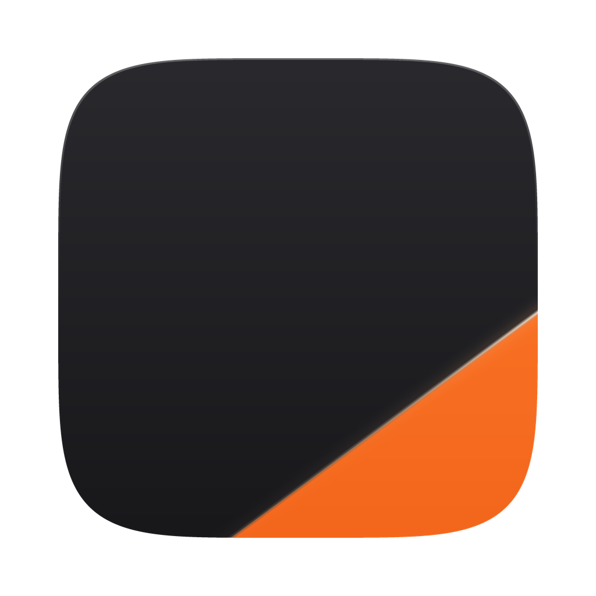

# CutKit

**Video ops toolbox for short-form content** — six tools in one app: before/after slider videos, screen-recording step edits, drag-photo demos, ring+arrow badges, Fotor screen-recording auto-edit, and a render history.

**短视频运营工具箱** —— 六个工具合一：前后对比滑杆视频、录屏步骤剪辑、拖照片演示、圆环箭头角标、Fotor 录屏自动剪辑、生成历史。由 PairCut 与 RosieCut 合并而来，两边功能与选项全部保留。

[](https://github.com/FIONN191/cutkit/releases/latest/download/CutKit-mac.dmg)
[](https://github.com/FIONN191/cutkit/releases/latest/download/CutKit-win-x64.exe)



## What it does / 功能

**Mode 1 — Before/After slider video.** Pick a folder of before/after images and CutKit renders a vertical video (1080×1920 @ 30fps): a white slider sweeps across each pair revealing *Before* on the left and *After* on the right, with corner labels, an optional top caption, rotational motion-blur transitions between scenes, and optional background music. The reveal mechanic is switchable — beyond the slider (sweep back and forth, or **sweep once all the way**) there are six alternatives that keep the same before/after payload but give the clip a completely different opening second and a different visual fingerprint: **reverse** (lead with the clean shot, let the filter creep back over it, then restore with a scan line), **wipe** (an eraser scrubs the filter off along a serpentine path), **flicker** (no gradient at all — hard cuts between the two, settling on the clean one), **progress** (a descending scan line plus a 0→100% processing bar), **comment** (opens with a TikTok-style comment card, then reveals), and **grid** (many pairs on screen at once, flipping tile by tile — 9 pairs = 3×3, 6 = 3×2, 4 = 2×2, 2–3 = a vertical strip). Every horizontal reveal (slider, wipe, grid) can run **right-to-left** (default) or **left-to-right**; the composition and corner labels mirror with it, so the clip always still reads Before → After.

**模式 1 — 前后对比滑杆视频。** 选一个装着前后图片的文件夹，CutKit 自动渲染竖版视频（1080×1920 @ 30fps）：白色滑杆在每对图上左右扫动，左边露出 Before、右边露出 After，带角标和可选顶部字幕，场景之间是旋转模糊转场，可选配 BGM。对比展示方式可切换 —— 除滑杆（**来回扫动**、**只滑一次滑到底**）外还有六种，前后图不变但开头第一秒和视觉指纹完全不同：**反向污染**（先给完整成图，滤镜再蔓延吞掉它，最后扫描线还原）、**手指擦除**（橡皮擦沿蛇形路径把滤镜抹掉）、**硬切闪频**（不做渐变，前后直接硬切交替，最后定格成图）、**进度条还原**（扫描线自上而下 + 0→100% 处理进度条）、**评论区驱动**（开头浮一张 TikTok 风格评论卡再还原）、**九宫格多米诺**（多对图同屏逐格翻转：9 对=3×3、6 对=3×2、4 对=2×2、2–3 对=竖排）。所有横向揭示（滑杆／擦除／九宫格）都可选**从右往左**（默认）或**从左往右**，画面构成和角标会跟着镜像，两个方向都仍然是 Before → After。

**Mode 2 — Screen-recording step edit.** Feed it a raw screen recording of using a filter app and it motion-detects the workflow, cuts out the waiting (AI processing queues etc. — a 90s recording becomes ~15s), and overlays four step captions (white with black stroke, toggleable): `Select Photo` → `Select the “X Effect”` → `Wait....` → `Results... ❤️`. The effect caption updates live from the filter name you type. Optionally the ending zooms the original result photo to full screen and holds (auto-mirrors to match the recording if the AI output is a flipped variant).

**模式 2 — 录屏步骤剪辑。** 丢给它一段滤镜 App 的原始操作录屏，自动运动检测操作流程、剪掉中间等待（AI 生成排队等，90 秒录屏压成 ~15 秒），叠加四段步骤字幕（白字黑描边，可开关）：`Select Photo` → `Select the “X Effect”` → `Wait....` → `Results... ❤️`。第二条字幕随输入的滤镜名实时变化。可选结尾效果：把结果原图放大铺满定格（原图与录屏方向不一致时自动镜像对齐）。

**Mode 3 — Drag-photo demo.** Recreates the "just upload one photo" tutorial ad: dashed upload box with a `+`, the photo flies in from the lower left and bounces as it lands, then **Fotor's colour transition** (progress ring → AI Generated badge, with its own dimming scrim) plays instead of a generic percentage loader. Give it the AI result photo and it cross-fades in exactly when the badge appears. Two motion styles — the flies-in-and-lands recreation, or a **cursor drag** that grabs the card from below, drags it along a curve and snaps it in (the drop frame adapts to any source aspect ratio: landscape, portrait or square). It can export a **transparent MOV** (QTRLE/ARGB) so the whole animation can be laid over your own footage in CapCut / 剪映, with an optional synthesised drag whoosh + snap click.

**模式 3 — 拖照片演示。** 复刻「上传一张照片」的教程广告：虚线上传框带 `+`，照片从左下飞入、落框时放大回弹，随后播放 **Fotor 彩色转场**（进度环 → AI Generated 徽章，自带压暗蒙版）替代通用的百分比加载动画。给了 AI 结果图的话，徽章出现的瞬间会交叉淡入。两种动画风格：复刻参考片的飞入落框，或**光标拖拽**——指针从下方抓起卡片、走弧线拖进框里再吸附（画框按原图比例自适应，横图竖图方图都行）。可导出**透明底 MOV**（QTRLE/ARGB），整段动画能直接盖到自己的素材上（剪映 / CapCut），并可加合成的拖拽风声 + 吸附咔哒音效。

**Mode 5 — Fotor screen-recording auto-edit** (was RosieCut). Classifies a Fotor screen recording into paint / type / wait states, re-times each run to a beat (target duration or automatic), auto-detects the crop, and — in *natural* mode — replaces the waiting segments with logo-free frames and overlays the pre-comp animation plus the Fotor watermark. Keeps every original control: presets (save / delete), natural-language instructions (offline, or via Claude with an API key), paint duration, typing speed-up, wait beat, final wait beat, natural vs ad version, overlay toggle and per-asset widths.

**模式 5 — Fotor 录屏自动剪辑**（原 RosieCut）。把 Fotor 录屏识别成「涂抹 / 打字 / 等待」三种状态，按节拍重排每段时长（可给目标时长，也可自动），自动检测裁剪；自然流版本还会把等待段替换成无 logo 画面，并叠加预合成动画与 fotor 水印。原有控件一个不少：预设（保存/删除）、自然语言指令（离线，或填 API key 走 Claude）、涂抹段时长、打字加速倍数、等待节拍、末尾等待节拍、自然流/广告版、叠加开关与各素材宽度。

**Mode 4 — Ring + arrow badge.** Upload a photo of any aspect ratio and get a **transparent-background MOV** (ProRes 4444, plus a PNG) holding the classic "original photo in a white ring with a hand-drawn arrow pointing at the result" callout — drop it straight onto your video. Geometry matches the reference creative (bottom-left, ring radius 0.161×W); live preview with sliders for crop, size and position; static by default, optional pop-in.

**模式 4 — 圆环箭头角标。** 上传任意比例的图，得到一段**透明底 MOV**（ProRes 4444，另存一张 PNG）：白色描边圆环里放原图，配一支手绘风箭头指向成片——直接压在原视频上就行。几何与竞品一致（左下角、外半径 0.161×宽），界面带实时预览，裁切/大小/位置都是滑块；默认全程静止，可选弹入动画。

Mode 1's top caption defaults to the TikTok-safe top band (y≈270 on 1080×1920) so it never covers faces. / 模式 1 的顶部字幕默认落在 TikTok 顶部安全区（1080×1920 下 y≈270），不压人脸。

- **Upload / 上传** — two labelled drop zones, *Before Image* and *After Image*: click one to open a file dialog, or drag a photo straight in. Fill both and CutKit adds them as a pair and clears the zones for the next one. Folder import is still there as a one-click bulk option.
  两个上传框 *Before Image* / *After Image*：点框选文件，或直接把图拖进去。两边都放好就自动加成一对并清空，接着放下一对。整个文件夹批量导入仍然保留。
- **Pairing / 配对** — the folder's images show as a thumbnail grid: **click one for Before, click another to pair it as After** (paired images dim out). Auto-pairing by visual similarity runs first as a starting point, and every pair can be swapped ⇄, deleted ✕, or reordered ↑↓; 手动加一对 works even without a folder.
  文件夹里的图以缩略图网格列出：**点一张选 Before、再点另一张配成 After**（已配对的图变暗）。按画面相似度的自动配对作为起点先跑一遍，每对都能交换 ⇄、删除 ✕、排序 ↑↓；「手动加一对…」不选文件夹也能用。
- **History / 历史记录** — every render is logged with a thumbnail, mode, duration, resolution, size and time; replay it, reveal it in Finder, copy it out or drop the record. Transparent MOVs get a checkerboard-backed thumbnail so you can actually see them.
  每次生成都会记进历史，带封面缩略图、模式、时长、分辨率、大小和时间；可播放、在 Finder 定位、复制出去或删除。透明 MOV 的封面会自动垫深色底，不会看着一片黑。
- **JianYing / 剪映素材夹** — optionally drop every render into one folder (default `~/Movies/CutKit 素材`). JianYing Pro encrypts its per-draft material list and declares no document types, so nothing can register media into its library programmatically; pointing 导入 → 素材 at this folder once is the closest reliable equivalent — after that the file dialog always reopens there.
  可选把每次成片同时放进一个固定文件夹（默认 `~/Movies/CutKit 素材`）。剪映专业版的草稿素材表是加密的、且没有声明任何 document type，所以任何程序都没法直接写进它的素材库；在剪映里 导入 → 素材 定位一次这个文件夹，之后文件框每次都停在这，是能可靠做到的最接近的做法。
- **Subject alignment / 人物对齐** — before/after images often differ in aspect ratio, and an AI-regenerated subject can be shifted or scaled, so the person doesn't line up across the slider. CutKit estimates a similarity transform (scale + translation + small rotation) and warps the After image onto the Before. Three strategies with automatic fallback — SIFT+RANSAC feature matching, ECC on gradient images (works when the subject is repainted), and phase correlation — scored by edge NCC, so a bad match is rejected rather than forced. By default both frames are cropped to their common area so there is no edge smearing. Per-pair comb preview with arrow-key nudging when you want to fine-tune.
  前后图常常比例不同，人物被 AI 重绘后还会位移缩放，滑杆两边接不上。CutKit 会估计相似变换（缩放+平移+小角度旋转）把 After 对到 Before：特征匹配 SIFT+RANSAC、梯度 ECC（人物被重绘时仍可用）、相位相关三种策略自动兜底，用边缘 NCC 打分——匹配不可靠时宁可不动也不硬套。默认把两张图裁到共同区域，不留边缘拉丝。每对可开梳齿预览并用方向键手动微调。
- **Native app / 原生应用** — a native WKWebView window (pywebview), no browser tab. Settings are remembered; outputs never overwrite (auto `-2`/`-3` suffix).
  原生窗口，非浏览器标签页；参数自动记忆；成片不覆盖旧文件（自动加 `-2`/`-3` 后缀）。
- **Self-contained / 零依赖** — ffmpeg is bundled (imageio-ffmpeg); frames are drawn with Pillow and piped straight into H.264.
  内置 ffmpeg，Pillow 逐帧绘制直灌 H.264 编码。

## Install / 安装

**macOS**: download the DMG above, drag to Applications. Unsigned app: first launch needs right-click → Open (or `xattr -cr /Applications/CutKit.app`).
**Windows**: download the portable EXE above and double-click — no install needed. SmartScreen may warn on first run; choose "More info → Run anyway".

**macOS**：点上方按钮下载 DMG，拖进 Applications。未签名应用：首次启动右键 →「打开」（或执行 `xattr -cr /Applications/CutKit.app`）。
**Windows**：点上方按钮下载便携版 EXE，双击即用（免安装）。首次运行 SmartScreen 提示时选「更多信息 → 仍要运行」。

## CLI / 命令行

```
# Mode 1: before/after slider video / 前后对比
/Applications/CutKit.app/Contents/MacOS/CutKit --cli <folder> \
    [-o out.mp4] [--caption "..."] [--scene-sec 3.6] \
    [--transition spin|none] \
    [--reveal sweep|once|reverse|wipe|flicker|progress|comment|grid] \
    [--direction rtl|ltr] \
    [--comment-user "@lena"] [--comment-text "can u remove the matcha filter"] \
    [--progress-text "Removing filter"] \
    [--audio bgm.mp3] [--plan-only]

# Mode 3: drag-photo demo / 拖照片演示
#   --motion drag  光标拖拽 · --transparent 透明 MOV · --sound 音效
/Applications/CutKit.app/Contents/MacOS/CutKit --cli-demo <photo.jpg> \
    [-o out.mp4] [--caption "Just upload one photo"] [--result ai-result.jpg] \
    [--motion slide|drag] [--transparent] [--sound] [--cursor|--no-cursor] \
    [--aspect-fit|--no-aspect-fit] [--no-transition]

# Mode 5: Fotor screen-recording auto-edit / 录屏自动剪辑（原 RosieCut）
/Applications/CutKit.app/Contents/MacOS/CutKit --cli-rosie <recording.mp4> \
    [-o out.mp4] [--target 15.5] [--paint-sec 1.67] [--type-speed 9] \
    [--wait-sec 0.8] [--last-wait-sec 0.8] [--crop W:H:X:Y] \
    [--mode natural|ad] [--no-overlay] [--precomp a.mov] [--watermark b.mov] \
    [--precomp-size 7.4] [--watermark-size 44] [--plan-only]

# Mode 4: ring + arrow badge (transparent MOV) / 圆环箭头角标
/Applications/CutKit.app/Contents/MacOS/CutKit --cli-ring <photo.jpg> \
    [-o out.mov] [--size 1080x1920] [--dur 8] [--x .214 --y .78] \
    [--radius .161] [--crop-x .5 --crop-y .4] [--pop]

# Mode 2: screen-recording step edit / 录屏步骤剪辑
/Applications/CutKit.app/Contents/MacOS/CutKit --cli-screen <recording.mp4> \
    [--filter "Game Face"] [-o out.mp4] [--wait-keep 0.8] [--tail-max 7] \
    [--no-captions] [--zoom-end --zoom-photo result.jpg] \
    [--audio bgm.mp3] [--plan-only]
```

`--plan-only` prints the plan (pairs / cut segments) without rendering. / 只打印配对或剪辑方案，不渲染。

## Build / 构建

Requires Python 3.9+ with `Pillow`, `pywebview`, `imageio-ffmpeg`, `pyinstaller`.

```
cd cutkit
pyinstaller --noconfirm CutKit.spec   # → dist/CutKit.app
```

## Layout / 结构

| File | |
|---|---|
| `render.py` | slider-video render engine + auto-pairing + CLI / 滑杆视频渲染引擎 + 自动配对 |
| `screencut.py` | screen-recording analyzer (wait-cut) + step captions / 录屏等待剪除 + 步骤字幕 |
| `rosiecut.py` `rosie.py` `nl.py` `analyze.py` | Fotor screen-recording auto-edit + natural-language params / 录屏自动剪辑 + 自然语言参数 |
| `align.py` | before/after subject alignment / 前后图人物对齐 |
| `history.py` | render history + JianYing material folder / 生成历史 + 剪映素材夹 |
| `dragdemo.py` `assets/` | drag-photo demo (2 motions, MP4 + transparent MOV) + bundled Fotor transition / 拖照片演示（两种动画、MP4 与透明 MOV）+ 内置 Fotor 转场 |
| `ringarrow.py` | ring+arrow badge → transparent MOV / 圆环箭头角标 → 透明底 MOV |
| `gui.py` | native window GUI (pywebview + local HTTP) / 原生窗口界面 |
| `CutKit.spec` | PyInstaller config / 打包配置 |
| `CutKit.icns` `iconsrc.png` | app icon / 图标 |
